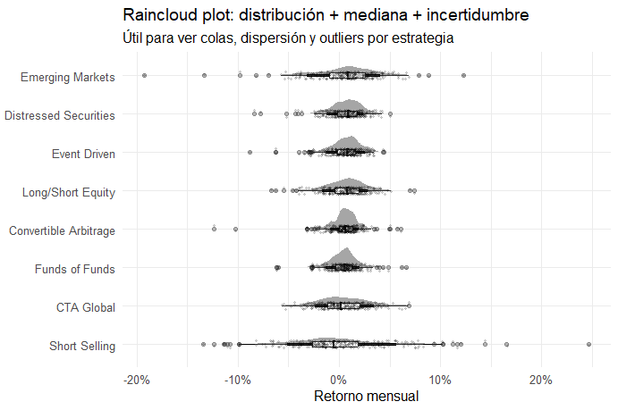
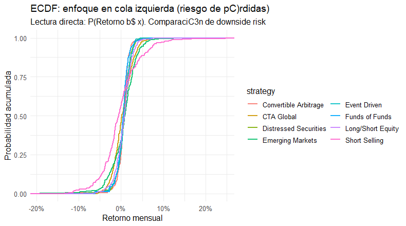
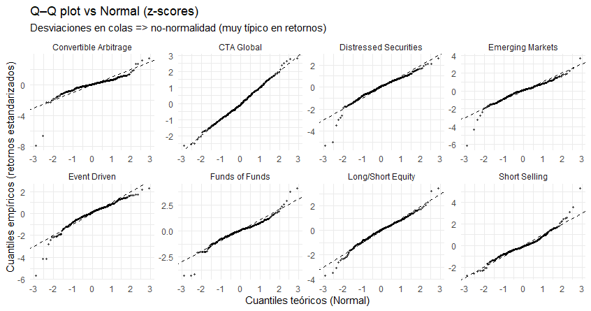
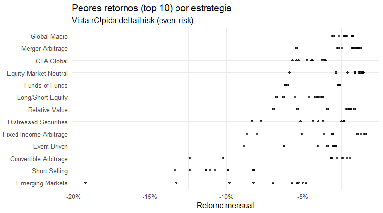
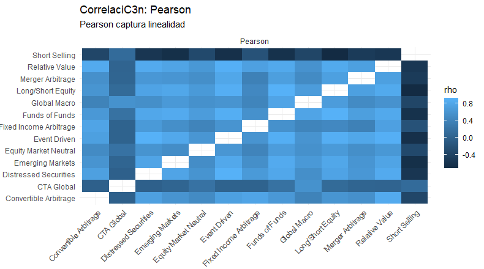
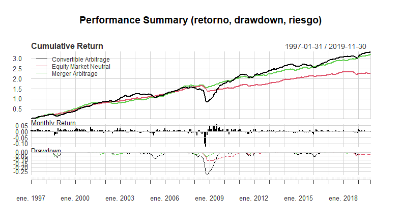
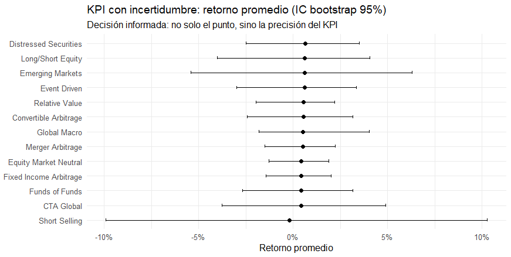
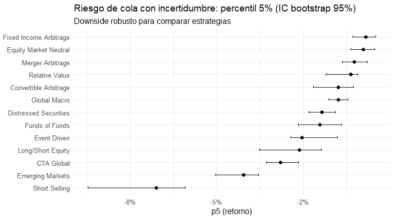

```{r 11-setup, include = FALSE}
# --- Paquetes (ajusta si ya los tienes en tu proyecto) ----
library(knitr)
library(tidyverse)
library(PerformanceAnalytics)
library(xts)
library(zoo)
library(scales)
library(ggridges)
library(ggdist)
library(GGally)
library(moments)
library(patchwork)


set.seed(123)
```


class: about-me, middle, center

# EDA


---

# Objetivo del EDA

Vamos a usar EDA **con mentalidad financiera** para responder preguntas reales:

- ¿Qué estrategia “se comporta mejor” **y con qué riesgo**?
- ¿Dónde están las **colas** (pérdidas extremas) y los **outliers**?
- ¿Qué tanto se “mueven juntas” las estrategias? (**correlación vs dependencia**)
- ¿Qué tan **incierto** es un KPI (media, percentil 5%)? (**bootstrap**)
- ¿Qué cambia en el tiempo? (**volatilidad rolling, drawdowns**)

---

# Dataset (contexto financiero)

Usaremos los retornos mensuales del dataset **EDHEC** (PerformanceAnalytics):

- Colección de índices de estrategias tipo *hedge funds* (p. ej., *Convertible Arb*, *Event Driven*, *CTA Global*, etc.)
- No lo tratamos como “vuelos”, sino como un *universo de estrategias* para **asignación y gestión de riesgo**
- Variable central: `ret` (retorno mensual), por `strategy`

> Interpretación: no buscamos “la mejor estrategia” en abstracto, sino **trade-offs**: retorno vs dispersión vs cola izquierda.


---

El dataset EDHEC no son “acciones individuales”. Es una colección de series de tiempo (retornos mensuales) que representan índices de desempeño de distintos estilos de inversión, típicos de la industria alternativa (muy usada por fondos institucionales).

- Cada columna (strategy) es un estilo.

- Cada fila (mes) es el retorno de ese estilo en ese mes.

----

### ¿Qué es un hedge fund?

Un hedge fund es un vehículo de inversión (un “fondo”) que suele tener más libertad que un fondo tradicional:

- puede usar ventas en corto (ganar si el precio cae),

- puede usar apalancamiento,

- puede operar con derivados,

- puede buscar retornos “más allá” del mercado accionario,

- y suele enfocarse en estrategias long/short, arbitraje, event-driven, macro, etc.

No significa “seguro” (la palabra hedge confunde). Significa: flexible y con herramientas para intentar ganar en distintos escenarios.


---

# ¿Qué son “estrategias tipo hedge fund”? (intuición de 4 ejemplos)

> *Convertible Arbitrage:* explotar desalineaciones entre un bono convertible y la acción subyacente (arbitraje).

> *Event Driven / Merger Arbitrage:* operar alrededor de eventos corporativos (fusiones, adquisiciones, reestructuraciones). Mucho riesgo “de salto”.

> *Equity Market Neutral:* construir posiciones para minimizar exposición al mercado (beta ≈ 0) y ganar por selección relativa.

> *CTA Global (Managed Futures):* estrategias sistemáticas en futuros (tendencias), puede diversificar bien en crisis… pero depende del régimen.

`En clase no necesitamos dominar el detalle operativo; lo importante es que cada estrategia tiene un “perfil de riesgo” distinto.`


---

# ¿Por qué esto sirve para EDA financiero?

Porque en finanzas rara vez basta con *“promedio”:

- Dos estrategias pueden tener misma media, pero una tiene colas pesadas *(crashes).*

- Otra puede tener outliers frecuentes o asimetría *(más caídas que subidas).*

- Otra puede tener riesgo que cambia con el tiempo *(volatilidad rolling).*

> Entonces EDA aquí es para responder:

### ¿qué estoy comprando en términos de distribución del riesgo?

---

# ¿Por qué esto sirve para EDA financiero?

**Qué significa la frase “trade-offs”**

No buscamos “la mejor estrategia” en abstracto porque siempre hay intercambio:

> Retorno esperado vs volatilidad

> Retorno vs cola izquierda (pérdidas extremas)

> Estabilidad vs picos de drawdown

> Diversificación vs dependencia en crisis


`“Si una estrategia tiene buena media pero una cola izquierda muy negativa, como gestor tengo que preguntarme si ese retorno compensa el riesgo de un mes catastrófico.”`

---

# Cargar y pasar a formato tidy

```{r}
data(edhec, package = "PerformanceAnalytics")
R_xts <- edhec

R_wide <- data.frame(
  date = as.Date(index(R_xts)),
  coredata(R_xts),
  check.names = FALSE
)

R_tbl <- R_wide %>%
  pivot_longer(-date, names_to = "strategy", values_to = "ret") %>%
  mutate(strategy = as.character(strategy),
         ret = as.numeric(ret)) %>%
  filter(is.finite(ret))

R_tbl
```

---

# EDA 1: distribuciones por grupo (forma, asimetría, colas)

**Pregunta financiera:** ¿qué estrategias tienen **más dispersión** y **colas** más pesadas?

- Si el centro parece similar, la decisión cambia por **cola izquierda** (pérdidas)
- La media “bonita” puede esconder **tail risk**

---

class: center, middle

```{r, echo=FALSE, out.width="95%"}
knitr::include_graphics("01_ridge.png")
```

---

# Lectura rápida del ridgeline

- **Ancho** = dispersión (volatilidad “promedio”)
- **Sesgo** = asimetría (más probabilidad de caídas o de subidas)
- **Colas** = eventos extremos (crisis, shocks, quiebres de liquidez)

**Discusión:**

1) ¿Qué estrategia se ve más “apretada”?  
2) ¿Cuál parece tener cola izquierda más fuerte?  
3) ¿Cuál parece más “asimétrica”?

---

# EDA 2: Raincloud (distribución + mediana + outliers)

**Por qué sirve en finanzas:** combina en un solo gráfico

- densidad (forma)
- caja/mediana (centro y dispersión robusta)
- puntos (outliers y cola)

---

class: center, middle

```{r, echo=FALSE, out.width="95%"}

```

---

# Interpretación (lo que quiero que se lleven)

- Los *outliers* no son “errores”: en finanzas suelen ser **eventos de cola**
- Dos estrategias con media similar pueden tener:
  - **colas distintas** → riesgo distinto
  - **incertidumbre distinta** → precisión del KPI distinta

---

# EDA 3: ECDF enfocada en cola izquierda

ECDF (Empirical Cumulative Distribution Function)

**Lectura directa:** En palabras simples: para cada umbral $x$, la ECDF te dice qué proporción de meses tuvo retornos $\le x$


$$
F(x) = P(\text{Retorno} \le x)
$$

En riesgo, queremos comparar **probabilidad de caer por debajo de umbrales**.

----

*Por qué nos sirve en finanzas:*

- No asume normalidad (no “fuerza” una distribución).

- Es perfecta para mirar cola izquierda: pérdidas y shocks.

- Te deja comparar estrategias en términos de: “¿qué tan frecuente es perder más de X%?”


`“La ECDF es como un contador acumulado de meses malos: a medida que muevo el umbral x, veo cuántas observaciones quedan por debajo.”`


---

class: center, middle

```{r, echo=FALSE, out.width="90%"}

```

---

# Cómo leer la ECDF como financiero

- Para un mismo \(x<0\): la curva **más arriba** tiene **más probabilidad** de pérdidas $\le x$
- Esto conecta con KPIs como:
  - $p5 / (VaR_{95})$ (cola)
  - *downside frequency* (frecuencia de meses malos)

----

- Para un mismo x < 0: la curva más arriba implica más probabilidad de pérdidas $\le x$ → peor downside.

- Si dos curvas se cruzan: una puede ser peor en pérdidas moderadas y otra peor en pérdidas extremas (trade-off de cola).


> “Si x=−5% una estrategia tiene F(x)=0.12, significa que en ~12% de los meses perdió 5% o más. Eso ya es un KPI de riesgo.”

**Mini‑pregunta:** ¿qué estrategia “domina” en riesgo downside?


---

# EDA 4: QQ‑plot (¿normalidad? ¿colas pesadas?)

**Por qué importa:**
- Si hay cola pesada, **VaR normal** tiende a subestimar pérdidas extremas
- En retornos financieros, la “no normalidad” es la regla, no la excepción

---

class: center, middle

```{r, echo=FALSE, out.width="95%"}

```

---

# Regla visual para QQ

- Si sigue la diagonal → “parecido a normal”
- Si se curva en las colas → **colas pesadas** (extremos más frecuentes)

**Toma de decisión:** cuando hay cola pesada, prioriza:
- percentiles/quantiles
- robustez
- bootstrap
- medidas downside (VaR/ES, drawdown)

---

# EDA 5: “peores retornos” (top 10 pérdidas)

**Idea:** ver el *tail risk* sin suponer distribuciones.

- Útil para *stress thinking*: “¿qué tan feo se puede poner?”
- Complementa VaR/ES (que son resúmenes)


----

> Si una estrategia tiene puntos más a la izquierda → tuvo eventos extremos más severos (peor cola izquierda).

> Si los 10 puntos están muy “regados” → la cola tiene variedad de pérdidas (no es solo un evento aislado).

> Si los 10 puntos están muy “juntos” → el tail es más “estable” (las peores pérdidas son parecidas entre sí).


`Este gráfico es un ‘escáner’ de severidad: no me dice cuándo pasó, me dice qué tan malo puede ser en los peores 10 meses.` >>> Interesante que identifiquen los meses! 

---

class: center, middle

```{r, echo=FALSE, out.width="95%"}

```

---

# Correlación vs Dependencia (cuidado)

**Correlación (Pearson)** mide linealidad promedio, pero en finanzas:

- Puede ocultar dependencia **en crisis** (cola)
- Puede cambiar por **régimen** (tranquilo vs turbulento)
- No distingue bien relaciones no lineales

**Mensaje clave:** *“baja correlación” no significa “independencia”*.

---

class: center, middle

```{r, echo=FALSE, out.width="92%"}

```

---

# Qué mirar en la matriz de correlación

- Bloques “azules” intensos → estrategias que se mueven juntas
- Estrategias con correlación baja pueden **co‑caer** en crisis (dep. en cola)
- Esto se conecta con diversificación y construcción de portafolio

**Pregunta:** ¿qué par te sugiere “diversificación” y cuál te sugiere “redundancia”?

---

# EDA temporal: volatilidad rolling y cambios de régimen

Volatilidad tiende a agruparse (*volatility clustering*).

- En crisis, la distribución cambia (colas se engrosan)
- *Rolling SD* ayuda a ver “cuándo” un riesgo se dispara


----

“Rolling” (o ventana móvil) significa que no calculas la volatilidad con todo el historial, sino con los últimos $k$ meses y vas “deslizando” esa ventana mes a mes.


### ¿Para qué sirve (finanzas)?

Porque el riesgo no es constante:

- En periodos tranquilos, la volatilidad suele ser baja.

- En crisis, la volatilidad sube y se queda alta un rato (eso es volatility clustering).

- Entonces, un solo número de volatilidad “promedio” puede mentir: mezcla épocas tranquilas con crisis.


---

class: center, middle

```{r, echo=FALSE, out.width="92%"}
knitr::include_graphics("06_roll_sd.png")
```

---

# Lectura del rolling SD

- Picos fuertes ≈ periodos tipo crisis (2008–2009 se nota)
- No es solo nivel: también importa **duración** del régimen
- Sirve para:
  - ajustar límites de riesgo
  - recalibrar VaR/ES
  - decidir rebalanceo


> Rolling SD te responde: “¿Cuándo se disparó el riesgo y cuánto duró ese régimen?”

---

# Performance summary (retorno + drawdown + riesgo)

En la práctica, muchos *dashboards* de portafolio miran:

**1) Retorno acumulado**

2) Retorno mensual (dispersión y shocks)  

3) Drawdown (profundidad y recuperación)


----

### 1) Arriba: Cumulative Return (crecimiento acumulado)

- Es cómo crece $1 (o 100) invertido en cada estrategia.

- Aquí el eje Y es retorno acumulado: empieza en 0. Si llega a 3.0, es +300% acumulado.

- Sirve para ver tendencia de largo plazo y si hay caídas grandes y recuperaciones.

> “Aquí veo quién crece más y quién sufrió quiebres grandes en la trayectoria.”


---


# Performance summary (retorno + drawdown + riesgo)

En la práctica, muchos *dashboards* de portafolio miran:

1) Retorno acumulado

**2) Retorno mensual (dispersión y shocks)  **

3) Drawdown (profundidad y recuperación)


----

### 2) Medio: Monthly Return (retorno mensual)

- Cada barrita es el retorno de ese mes.

- Muestra volatilidad y meses extremos (colas).

- En crisis ves barras negativas grandes (shocks).

> “Este panel me recuerda que la curva de arriba se construye con meses buenos y malos; aquí se ven los extremos.”


---


# Performance summary (retorno + drawdown + riesgo)

En la práctica, muchos *dashboards* de portafolio miran:

1) Retorno acumulado

2) Retorno mensual (dispersión y shocks)  

**3) Drawdown (profundidad y recuperación)**


----

### 3) Abajo: Drawdown

Drawdown = caída desde el máximo histórico (peak) hasta el valor actual.

- Siempre es 0 o negativo.

- 0 cuando estás en máximo histórico.

- -0.25 significa que estás 25% por debajo de tu máximo.

> “El drawdown es la pérdida ‘desde el pico’. No mide variación mensual: mide cuánto me he alejado del mejor momento que llevaba.”


---

class: center, middle

```{r, echo=FALSE, out.width="95%"}

```

---

# Inferencia “ligera”: Bootstrap para KPIs

En gestión, el KPI no es solo el punto (media/p5):

- ¿qué tan preciso es?
- ¿qué pasa si el histórico cambia un poco?
- ¿la diferencia entre estrategias es “real” o ruido?


> Bootstrap = re‑muestreo para aproximar incertidumbre sin supuestos fuertes.


Bootstrap es una técnica para *simular muchos “históricos alternativos”* a partir del histórico que ya tenemos, para *medir incertidumbre.*


---

# KPI con incertidumbre: media (IC bootstrap 95%)


### ¿Qué se está re-muestreando?

Se re-muestran los retornos mensuales (las observaciones) de una estrategia:

- Tomo la misma cantidad de meses que tengo (por ejemplo 275),

- pero los vuelvo a “armar” re-sorteando meses del mismo histórico, permitiendo repetidos,

- y con cada histórico “reconstruido” recalculo el KPI.

> Esto produce una distribución del KPI (no solo un punto): una nube de medias, una nube de p5, etc.

> Obtienes: Una idea de qué tanto puede variar el KPI solo por azar muestral. No te quedas con “la media es 0.5%”, sino con “la media suele estar entre X y Y la mayoría de las veces”.

---

# KPI con incertidumbre: media (IC bootstrap 95%)

### ¿Para qué sirve en finanzas?

- Construir bandas de incertidumbre (intervalos) para KPIs.

- Detectar KPIs frágiles: cambian mucho con pequeñas variaciones del historial.

- Comparar estrategias: si las distribuciones de KPI se traslapan mucho, la “diferencia” puede ser ruido más que señal.

`“El bootstrap responde: si mi muestra hubiera sido ligeramente distinta, ¿este KPI seguiría diciendo lo mismo?”`

**Lectura:** punto = estimación, barra = incertidumbre.

- Si los IC se traslapan mucho, “ranking” es frágil
- Si un IC cruza 0, cuidado con prometer “retorno positivo”

---

class: center, middle

```{r, echo=FALSE, out.width="92%"}

```

---

# KPI con incertidumbre: percentil 5% (cola)

**p5** responde a: “en un mes malo, ¿qué tan malo puede ser?”

- Más negativo → peor downside
- IC ayuda a comparar sin vender humo

---

class: center, middle

```{r, echo=FALSE, out.width="92%"}

```

---

# Visuales con incertidumbre (takeaways)

Cuando reportes KPIs financieros, intenta que siempre haya:

- punto + barra (IC/percentiles)
- comparación por grupos (estrategias/activos/segmentos)
- lectura enfocada en decisión (¿qué haría yo con esto?)

---

# Código R - EDA Financiero

```{r, eval=FALSE}


library(tidyverse)
library(PerformanceAnalytics)
library(xts)
library(zoo)
library(ggridges)
library(ggdist)
library(patchwork)
library(scales)
library(GGally)
library(moments)

set.seed(123)

# 1) Cargar datos --------------------------------------------
data(edhec, package = "PerformanceAnalytics")
R_xts <- edhec

# 1) Wide limpio (data.frame) + nombres correctos
R_wide <- data.frame(
  date = as.Date(index(R_xts)),
  coredata(R_xts),
  check.names = FALSE
)

# 2) Long limpio (ret numérico)
R_tbl <- R_wide %>%
  pivot_longer(-date, names_to = "strategy", values_to = "ret") %>%
  mutate(
    strategy = as.character(strategy),
    ret = as.numeric(ret)
  ) %>%
  filter(is.finite(ret))

# 3) Top N estrategias por volatilidad (sd)
topN <- 8
top_strat <- R_tbl %>%
  group_by(strategy) %>%
  summarise(sd_ret = sd(ret), .groups = "drop") %>%
  arrange(desc(sd_ret)) %>%
  slice_head(n = topN) %>%
  pull(strategy)

R_top <- R_tbl %>% filter(strategy %in% top_strat)

# 3) KPIs básicos + colas (pero serios) ----------------------
kpi_tbl <- R_tbl %>%
  group_by(strategy) %>%
  summarise(
    n = n(),
    mean = mean(ret, na.rm = TRUE),
    med  = median(ret, na.rm = TRUE),
    sd   = sd(ret, na.rm = TRUE),
    skew = moments::skewness(ret, na.rm = TRUE),
    kurt = moments::kurtosis(ret, na.rm = TRUE),
    p01  = quantile(ret, 0.01, na.rm = TRUE),
    p05  = quantile(ret, 0.05, na.rm = TRUE),
    p50  = quantile(ret, 0.50, na.rm = TRUE),
    p95  = quantile(ret, 0.95, na.rm = TRUE),
    p99  = quantile(ret, 0.99, na.rm = TRUE),
    min  = min(ret, na.rm = TRUE),
    max  = max(ret, na.rm = TRUE),
    .groups = "drop"
  ) %>%
  arrange(p05)

kpi_tbl

# 4) Distribución / colas / no-normalidad --------------------
# 4.1 Ridgelines (densidades apiladas) para comparar estrategias

ord <- R_top %>%
  group_by(strategy) %>%
  summarise(sd_ret = sd(ret), .groups = "drop") %>%
  arrange(desc(sd_ret)) %>%
  pull(strategy)

R_top2 <- R_top %>%
  mutate(strategy_ord = factor(strategy, levels = ord))

p_ridge <- ggplot(R_top2, aes(x = ret, y = strategy_ord, fill = strategy_ord)) +
  geom_density_ridges(alpha = 0.65, scale = 1.2, rel_min_height = 0.01, color = "white") +
  theme_minimal(base_size = 12) +
  guides(fill = "none") +
  labs(
    title = "Distribución de retornos (ridgelines)",
    subtitle = "Comparación visual de forma, asimetría y colas entre estrategias",
    x = "Retorno mensual", y = NULL
  ) +
  scale_x_continuous(labels = percent_format(accuracy = 1))

p_ridge

# 4.2 Raincloud (halfeye + box + puntos) — EDA de alta calidad
p_rain <- R_top %>%
  ggplot(aes(x = fct_reorder(strategy, ret, .fun = median), y = ret)) +
  ggdist::stat_halfeye(
    adjust = 0.7, width = 0.6, .width = c(0.5, 0.8, 0.95)
  ) +
  geom_boxplot(width = 0.15, outlier.alpha = 0.35) +
  geom_point(alpha = 0.15, position = position_jitter(width = 0.1), size = 0.8) +
  coord_flip() +
  theme_minimal(base_size = 12) +
  labs(
    title = "Raincloud plot: distribución + mediana + incertidumbre",
    subtitle = "Útil para ver colas, dispersión y outliers por estrategia",
    x = NULL, y = "Retorno mensual"
  ) +
  scale_y_continuous(labels = percent_format(accuracy = 1))

# 4.3 ECDF (cola izquierda enfocada)
p_ecdf <- R_top %>%
  ggplot(aes(x = ret, color = strategy)) +
  stat_ecdf(size = 0.9, alpha = 0.9) +
  theme_minimal(base_size = 12) +
  labs(
    title = "ECDF: enfoque en cola izquierda (riesgo de pérdidas)",
    subtitle = "Lectura directa: P(Retorno ≤ x). Comparación de downside risk",
    x = "Retorno mensual", y = "Probabilidad acumulada"
  ) +
  scale_x_continuous(labels = percent_format(accuracy = 1)) +
  guides(color = guide_legend(ncol = 2))

# 4.4 Q-Q plot vs Normal (por estrategia) para mostrar no-normalidad
# Nota: muchas facetas pueden saturar; usa top 6-8
qq_data <- R_top %>%
  group_by(strategy) %>%
  mutate(
    z = (ret - mean(ret)) / sd(ret),
    q_theo = qnorm(ppoints(n())),
    q_emp  = sort(z),
    q_theo_sorted = sort(q_theo)
  ) %>%
  summarise(q_theo = q_theo_sorted, q_emp = q_emp, .groups = "drop_last") %>%
  ungroup()

p_qq <- qq_data %>%
  ggplot(aes(x = q_theo, y = q_emp)) +
  geom_point(alpha = 0.6, size = 0.8) +
  geom_abline(slope = 1, intercept = 0, linetype = 2) +
  facet_wrap(~strategy, scales = "free", ncol = 4) +
  theme_minimal(base_size = 11) +
  labs(
    title = "Q–Q plot vs Normal (z-scores)",
    subtitle = "Desviaciones en colas => no-normalidad (muy típico en retornos)",
    x = "Cuantiles teóricos (Normal)", y = "Cuantiles empíricos (retornos estandarizados)"
  )

# Mostrar bloque de distribuciones
print(p_ridge)
print(p_rain)
print(p_ecdf)
print(p_qq)

# 5) Outliers y eventos extremos -----------------------------
# 5.1 Outliers robustos por estrategia usando MAD (más financiero que z-score)
out_tbl <- R_tbl %>%
  group_by(strategy) %>%
  mutate(
    med = median(ret),
    mad = mad(ret, constant = 1),  # constante 1 para escala tipo MAD cruda
    robust_z = (ret - med) / (mad + 1e-12),
    outlier_mad = abs(robust_z) > 5
  ) %>%
  summarise(
    outliers = sum(outlier_mad),
    out_rate = mean(outlier_mad),
    worst_1 = min(ret),
    worst_5 = quantile(ret, 0.05),
    .groups = "drop"
  ) %>%
  arrange(desc(out_rate))

print(out_tbl)

# 5.2 Peores 10 retornos por estrategia (evento-riesgo)
worst10 <- R_tbl %>%
  group_by(strategy) %>%
  slice_min(ret, n = 10, with_ties = FALSE) %>%
  ungroup()

p_worst <- worst10 %>%
  ggplot(aes(x = ret, y = fct_reorder(strategy, ret, .fun = min))) +
  geom_point(alpha = 0.7) +
  theme_minimal(base_size = 12) +
  labs(
    title = "Peores retornos (top 10) por estrategia",
    subtitle = "Vista rápida del tail risk (event risk)",
    x = "Retorno mensual", y = NULL
  ) +
  scale_x_continuous(labels = percent_format(accuracy = 1))

print(p_worst)

# 6) Dinámica temporal: vol rolling, VaR/ES rolling, drawdowns -
# Pasar a xts para rolling fácil
# Elegimos 3 estrategias para series temporales (ajusta si quieres)
# 6.1 Volatilidad rolling (12 meses)
roll_sd <- zoo::rollapply(R_pick, width = 12, FUN = sd, align = "right", fill = NA)

roll_sd_wide <- data.frame(
  date = as.Date(index(roll_sd)),
  coredata(roll_sd),
  check.names = FALSE
)
names(roll_sd_wide) <- c("date", colnames(roll_sd))

roll_sd_tbl <- roll_sd_wide %>%
  pivot_longer(-date, names_to = "strategy", values_to = "roll_sd") %>%
  mutate(roll_sd = as.numeric(roll_sd)) %>%
  filter(is.finite(roll_sd))

p_roll_sd <- ggplot(roll_sd_tbl, aes(x = date, y = roll_sd, color = strategy)) +
  geom_line(linewidth = 0.9) +
  theme_minimal(base_size = 12) +
  labs(
    title = "Volatilidad rolling (12 meses)",
    subtitle = "EDA temporal: cambios de régimen y clustering de volatilidad",
    x = NULL, y = "SD rolling (retorno mensual)"
  ) +
  scale_y_continuous(labels = percent_format(accuracy = 1))

p_roll_sd


# 6.3 Drawdowns (EDA financiero clásico)
# PerformanceAnalytics trae chart.Drawdown y findDrawdowns
# (en script no guardamos el gráfico ggplot, pero lo mostramos)
par(mfrow = c(1,1))
charts.PerformanceSummary(R_pick, main = "Performance Summary (retorno, drawdown, riesgo)")

# 7) Dependencia: Pearson/Spearman + cola ---------------------
# 7.1 Matrices de correlación (Pearson)
cor_p <- cor(R_xts, use = "pairwise.complete.obs", method = "pearson")


# Convertir a tidy para heatmap con ggplot
cor_to_tbl <- function(M, name = "pearson"){
  as.data.frame(M) %>%
    rownames_to_column("A") %>%
    pivot_longer(-A, names_to = "B", values_to = "rho") %>%
    mutate(type = name)
}

cor_tbl <- bind_rows(
  cor_to_tbl(cor_p, "Pearson")
)

p_cor <- cor_tbl %>%
  filter(A != B) %>%
  ggplot(aes(x = A, y = B, fill = rho)) +
  geom_tile() +
  facet_wrap(~type, ncol = 2) +
  theme_minimal(base_size = 11) +
  theme(axis.text.x = element_text(angle = 45, hjust = 1)) +
  labs(
    title = "Correlación: Pearson",
    subtitle = "Pearson captura linealidad",
    x = NULL, y = NULL
  )

print(p_cor)


# 8) Bootstrap para KPIs + incertidumbre ----------------------
# KPI ejemplo: media (retorno) y p5 (downside) por estrategia
boot_ci <- function(x, stat = mean, B = 3000, alpha = 0.05){
  x <- x[is.finite(x)]
  boots <- replicate(B, stat(sample(x, replace = TRUE)))
  quantile(boots, c(alpha/2, 1 - alpha/2))
}

ci_kpi <- R_tbl %>%
  group_by(strategy) %>%
  summarise(
    mean = mean(ret),
    lo_mean = boot_ci(ret, mean)[1],
    hi_mean = boot_ci(ret, mean)[2],
    p05 = quantile(ret, 0.05),
    lo_p05 = boot_ci(ret, function(z) quantile(z, 0.05))[1],
    hi_p05 = boot_ci(ret, function(z) quantile(z, 0.05))[2],
    .groups = "drop"
  ) %>%
  arrange(mean)

# 8.1 Error bars (retorno promedio con IC)
p_ci_mean <- ci_kpi %>%
  ggplot(aes(x = reorder(strategy, mean), y = mean)) +
  geom_point(size = 2) +
  geom_errorbar(aes(ymin = lo_mean, ymax = hi_mean), width = 0.2) +
  coord_flip() +
  theme_minimal(base_size = 12) +
  labs(
    title = "KPI con incertidumbre: retorno promedio (IC bootstrap 95%)",
    subtitle = "Decisión informada: no solo el punto, sino la precisión del KPI",
    x = NULL, y = "Retorno promedio"
  ) +
  scale_y_continuous(labels = percent_format(accuracy = 1))

# 8.2 Error bars (p5 con IC) — cola izquierda
p_ci_p05 <- ci_kpi %>%
  ggplot(aes(x = reorder(strategy, p05), y = p05)) +
  geom_point(size = 2) +
  geom_errorbar(aes(ymin = lo_p05, ymax = hi_p05), width = 0.2) +
  coord_flip() +
  theme_minimal(base_size = 12) +
  labs(
    title = "Riesgo de cola con incertidumbre: percentil 5% (IC bootstrap 95%)",
    subtitle = "Downside robusto para comparar estrategias",
    x = NULL, y = "p5 (retorno)"
  ) +
  scale_y_continuous(labels = percent_format(accuracy = 1))

print(p_ci_mean)
print(p_ci_p05)

# 9) Panel final (composición pro) ----------------------------
# Un “dashboard” estático para escoger qué se vuelve slides

library(cowplot)

cowplot::plot_grid(
  p_ridge + theme(legend.position="none"),
  p_rain  + theme(legend.position="none"),
  p_roll_sd + theme(legend.position="none"),
  p_ci_p05  + theme(legend.position="none"),
  ncol = 2
)


```


